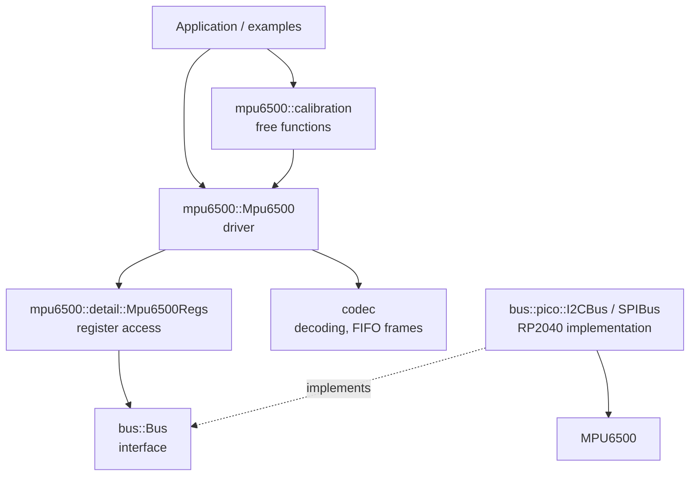

# Architecture

This document explains how the library is built and why. It is meant for anyone who wants
to change the driver, port it to another microcontroller, or understand a design decision.

## Layers

| Layer | Knows about | Does not know about |
|---|---|---|
| `bus` | reading and writing bytes to registers | the MPU6500, the Pico |
| `bus_pico` | Pico SDK I2C and SPI | the MPU6500 |
| `registers` | register addresses, bit masks, read-modify-write | units, configuration logic |
| `codec` | byte order, scales, FIFO frame layout | the bus |
| driver | configuration, modes, units, flag ownership | the Pico SDK |
| `calibration` | the public driver API | anything private |

The dependency direction is strictly downwards. The driver depends on the `bus::Bus`
interface, never on `bus_pico`. This is what keeps the driver portable and testable.

## Libraries and headers

| Library | Path | Depends on |
|---|---|---|
| `bus` | `lib/bus` | nothing |
| `bus_pico` | `lib/bus_pico` | `bus`, Pico SDK |
| `math` | `lib/math` | nothing |
| `mpu6500` | `mpu6500` | `bus`, `math` |
| `orientation` | `lib/orientation` | `math` (used by the tilt example only) |

Inside `mpu6500`:

| Path | Visibility | Contents |
|---|---|---|
| `include/mpu6500/` | public | `Mpu6500`, `Config`, `Sample`, `InterruptFlags`, calibration |
| `include/mpu6500/detail/` | public, but not for users | `Mpu6500Regs`, needed because `Mpu6500` holds it by value |
| `src/driver/` | private | methods of `Mpu6500`, one topic per file |
| `src/registers/` | private | register map, bit masks, `Mpu6500Regs` implementation |
| `src/codec/` | private | decoding and FIFO frame parsing, pure functions |
| `src/calibration.cpp` | private | calibration free functions |

Private headers live in `src/` and are only on the library's private include path, so
applications cannot depend on register addresses or bit masks.

## Design decisions

### 1. The configuration is the single source of truth

The driver holds one `config::Config` that describes the desired state of the chip.

- `init()` checks `WHO_AM_I`, resets the chip, disables I2C when SPI is used, and calls
  `apply_config()`, which writes the whole configuration.
- Every setter writes its register and, only if the write succeeded, updates the
  configuration.
- `config()` returns a **const** reference. There is no way to change the configuration
  without going through a setter, so the cached state and the chip cannot drift apart.

After a reset the chip loses all settings, but the driver does not: calling `init()` again
restores everything from the configuration.

### 2. `apply_config` writes in a fixed order

| Step | Why here |
|---|---|
| Wake the chip, clock source | registers must be writable and the clock stable |
| Ranges, filters, divider, hardware gyro offset | measurement settings first |
| Wake-on-motion threshold, then WoM logic | threshold before enable, or the first sample triggers |
| `apply_power()` | after measurement settings, because low-power mode overrides the accel filter |
| FIFO: disable, sources, mode, reset, clear stale flags, enable | nothing is buffered while settings change |
| INT pin configuration, then interrupt sources | polarity set before sources, so no false edge |

When the FIFO is disabled, no FIFO sources are written. The chip keeps buffering
into the FIFO when sources are set, even with the FIFO disabled, and would report overflows.

### 3. Power modes are an overlay, not a backup

`config.power.mode` is `Normal`, `Sleep` or `LowPowerAccel`. The configuration always keeps
what the user asked for. `apply_power()` computes the register values from the mode:

| Setting | Normal | Sleep | LowPowerAccel |
|---|---|---|---|
| `SLEEP` | 0 | **1** | 0 |
| `CYCLE` | 0 | 0 | **1** |
| `GYRO_STANDBY` | config | config | **0** |
| Temperature sensor | config | config | **off** |
| Gyro axes | config | config | **off** |
| Accel axes | config | config | config |
| Accel filter | config | config | **bypass** |
| Wake-up rate | — | — | `low_power_rate` |

Leaving low-power mode is therefore just "write the configuration as it is": no backup, no
restore, nothing to forget. `CYCLE` is cleared first and set last, so the chip never cycles
with half-written settings.

Setters that touch overridden settings (`set_accel_filter`, `set_temperature_enabled`,
`set_enabled_axes`) always update the configuration but only write the register if the
current mode does not override it.

### 4. Interrupt flags have owners

Reading `INT_STATUS` clears **all** flags at once. If two parts of the code read it, one of
them loses its events. The driver solves this with a flag cache:

- `poll_int_status()` is the only place that reads `INT_STATUS` during operation. It ORs the
  new flags into `pending_int_flags_`; it never clears anything.
- Every flag has exactly one owner, and only the owner clears it in the cache:

| Flag | Owner | Why |
|---|---|---|
| FIFO overflow | `read_fifo()` | only it knows the FIFO must be reset after an overflow |
| Data ready | the user, via `take_interrupt_flags()` | the user decides what to read |
| Wake-on-motion | the user, via `take_interrupt_flags()` | same |

`take_interrupt_flags()` reports all flags but clears only the ones the user owns, so a FIFO
overflow seen by the user is still handled by the next `read_fifo()`. `apply_config()` is the
only place that clears the whole cache: old flags mean nothing after a reconfiguration.

### 5. The FIFO is read in whole frames

The frame layout (accel, temperature, gyro, in that order) is computed from the configured
sources by a pure function. `read_fifo()` reads only whole frames and leaves a partial frame
in the buffer.

The FIFO drops the oldest **bytes**, not frames, when it overflows in `Overwrite` mode. 512
bytes are not a multiple of the frame size, so after an overflow the frame boundaries are
lost. The driver therefore resets the FIFO and returns zero frames. In `StopWhenFull` mode
the data stays aligned and is returned, with `overflowed` set.

### 6. Errors and the bus

All bus operations return `bus::Status` (`OK`, `TIMEOUT`, `NACK`, `ERROR`). The macro
`MPU_RETURN_IF_ERROR` returns early on any non-OK status, which keeps the driver code linear.
Errors that are not bus errors (wrong mode, board moved during calibration) are reported as
`ERROR`.

SPI has no acknowledge. A write that goes to the wrong place is invisible to the bus. This
is how a bug in the SPI write address went unnoticed: every write became a read, and
`init()` still returned `OK`. See [known-issues.md](known-issues.md).

### 7. Units and naming

- Public values use physical units: g, °/s, °C, mg, Hz. Field names carry the unit when it
  could be confused (`accel_offset_g`, `gyro_offset_dps`, `threshold_mg`).
- Software offsets are stored in physical units, so changing the range does not invalidate
  them.
- `read_*_uncorrected()` returns scaled values **before** the software offset is subtracted.
  Raw register counts are `RawVec3` and only appear in the codec and the hardware offset.

### 8. Sample rate helpers are pure

`gyro_sample_rate_hz()`, `accel_sample_rate_hz()` and `divider_effective()` compute the rate
from the configuration only, without reading the chip. The rules:

- gyro filter 184…5 Hz: internal rate 1 kHz, divider applies, rate = 1000 / (1 + divider);
- gyro filter 250 Hz or 3600 Hz: 8 kHz, divider ignored;
- gyro bypass: 32 kHz, divider ignored;
- accelerometer: 1 kHz (divided only when the divider applies), 4 kHz in bypass;
- low-power mode: accelerometer at the wake-up rate, gyro 0.

These rules are verified on hardware in [measurements.md](measurements.md).

### 9. Calibration is outside the class

Calibration needs only the public API: read uncorrected data, know the sample rate, wait,
set the offset. It is implemented as free functions in `mpu6500::calibration` that take a
driver reference. The driver itself only stores and applies offsets.

### 10. The platform is injected

The driver never calls the Pico SDK. It gets:

- a `bus::Bus&` for all register access;
- a `WaitFunction` (`void (*)(uint32_t ms)`) for the delays required after resets and during
  calibration.

The application sets up the bus (pins, clock, pull-ups). This also allows several devices on
the same bus.

## Rules for interrupts

- The driver is **not** safe to call from an interrupt handler. Bus transfers are blocking
  and may already be in progress in the main loop.
- The GPIO interrupt handler should only set a flag. The main loop clears the flag, calls
  `take_interrupt_flags()` and handles the events.
- Clear the flag **before** calling `take_interrupt_flags()`, so an interrupt that arrives
  during the read is not lost.

Details and examples in [interrupts.md](interrupts.md).

## Porting to another microcontroller

1. Implement `bus::Bus` for your platform: read N bytes starting at a register, and write one
   byte to a register. For SPI, set bit 7 of the address for reads and clear it for writes.
2. Provide a delay function with the `WaitFunction` signature.
3. Set up the bus pins and clock in your application.
4. Construct `mpu6500::Mpu6500` with the bus, the delay function and a `Config`.

Nothing in `mpu6500/` needs to change.

## Adding a feature

1. Add the register address to `src/registers/register_map.hpp` and the bit masks to
   `src/registers/bits.hpp`.
2. Add a function to `Mpu6500Regs` that writes the setting, using `update_bits` so that other
   fields in the same register are kept.
3. Add the setting to `Config` with a default that matches the chip's reset value or leaves
   the feature off.
4. Write it in `apply_config()` at the right place in the order above.
5. Add a setter that writes the register and then updates the configuration.
6. If the feature produces an interrupt flag, decide who owns it and handle it in
   `take_interrupt_flags()`.
7. Add an example and update the documentation.
